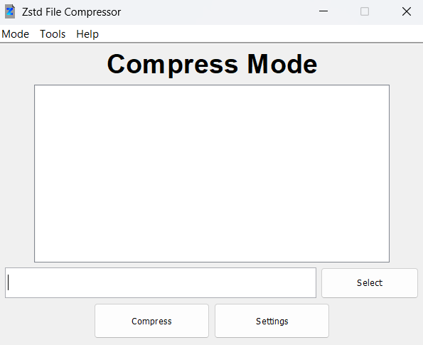

# Zstd-File-Compressor

A tool for compressing and decompressing files using the [Zstandard](https://facebook.github.io/zstd/) algorithm with GUI

# Features
- Compress Mode for files compression
- Compress with dictionary 
- Decompress Mode for files compression
- Decompress with dictionary
- Dictionary Trainer for better files compression

# Usage

**1.** You can select the compression and decompression mode by selecting Mode and Dictionary Trainer by selecting Tools in the menu bar

**2.** In the empty field you can enter the file or folder path or you can press the select button to select the files or folders you want in compression or decompression mode

**3.** The settings button it will take you to the settings window

- **Compress Mode**
    
    You can enter path of file for compression with dictionary and in compression level you can choose from level 1 - 22. If you press the cancel button the compression level will default to level 11
  
- **Decompress Mode**

    You can enter only path of file for decompression with dictionary

- **Dictionary Trainer**

    You can enter only path of folder for output file

**4.** When you press the compress, decompress, or create button, the result of the process will be in the file/folder path you specified

## Dictionary Trainer Error

If you can't train your dictionary, maybe you don't have enough sample files

# Warning

For safety, if you are using compression with dictionary, it's recommended to back up the original file or the dictionary you are using. If either of them gets damaged, you will not be able to decompress the file

# Libraries used
- [zstd-jni](https://github.com/luben/zstd-jni) (version 1.5.7-2)
- [commons-io](https://github.com/apache/commons-io) (version 2.19.0)

#Future Updates (Maybe)
- Add own file signature
- Add checksum
- Update compress/decompress method
- Update dictionary trainer method

# Requirements

- **JDK 24 or higher** is required to run this program

If you don’t have JDK 24 installed, download and install it from the following link:

- [JDK 24 Download](https://jdk.java.net/24/)

# License
This project is licensed under the [Apache-2.0](LICENSE)
